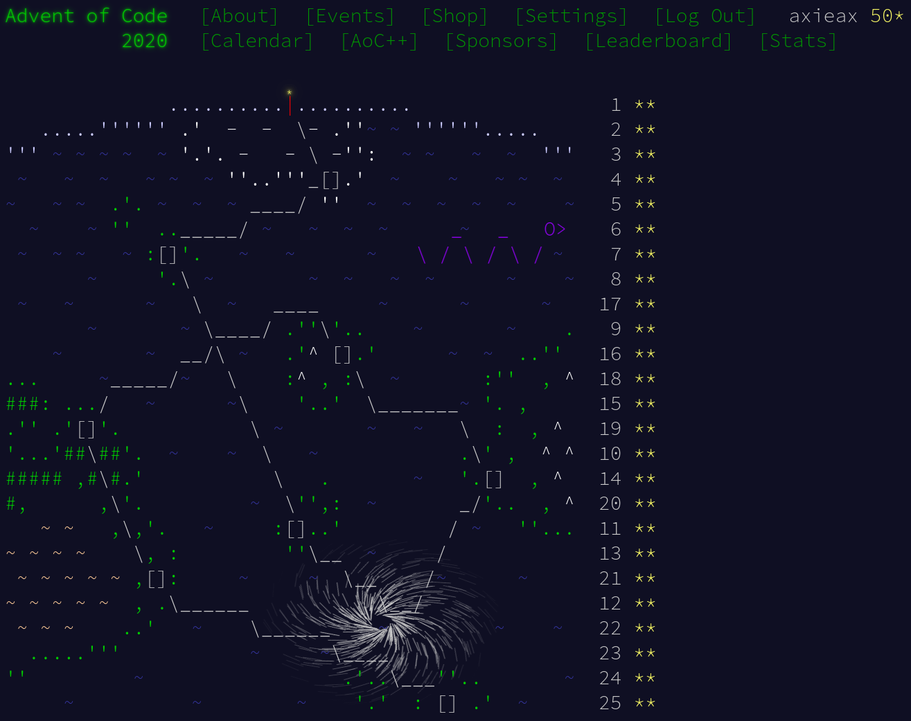

# Advent of Code

> Advent of Code is an Advent calendar of small programming puzzles for a variety of skill sets and skill levels that can be solved in any programming language you like. People use them as a speed contest, interview prep, company training, university coursework, practice problems, or to challenge each other.

This repository contains my solutions to the Advent of Code problems, which I took as fun problem solving / competitive programming exercises.

## Advent of Code 2020

[https://adventofcode.com/2020](https://adventofcode.com/2020)

## Advent of Code 2021

[https://adventofcode.com/2021](https://adventofcode.com/2021)

